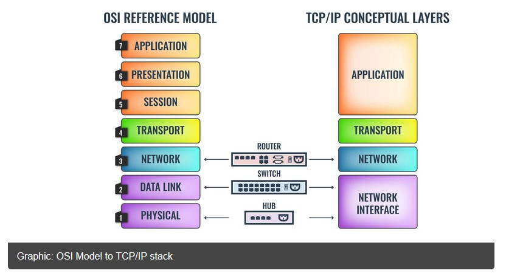
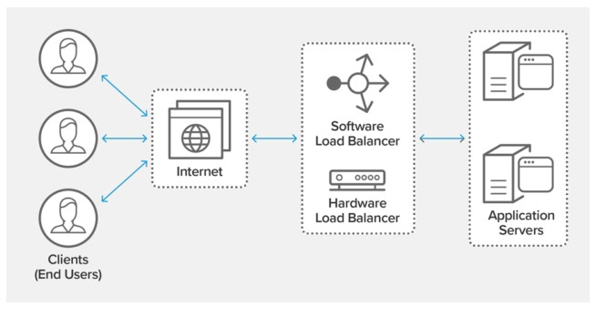

# Project 4 -  IMPLEMENTING MEAN Stack on AWS

### **MEAN Stack is a combination of following components:**

  **MongoDB (Document database)** – Stores and allows to retrieve data.

  **Express (Back-end application framework)** – Makes requests to Database for Reads and Writes.

  **Angular (Front-end application framework)** – Handles Client and Server Requests.

  **Node.js (JavaScript runtime environment)** – Accepts requests and displays results to end user.


## __OSI MODEL__

    The OSI Model (Open Systems Interconnection Model) is a conceptual framework used to describe the functions of a networking system. 

    The OSI model characterizes computing functions into a universal set of rules and requirements in order to support interoperability between different products and software. 
    
    In the OSI reference model, the communications between a computing system are split into seven different abstraction layers: 
    
    - Physical (Layer 7)
    - Data Link (Layer 6)
    - Network (Layer 5)
    - Transport (Layer 4)
    - Session (Layer 3)
    - Presentation (Layer 2)
    - Application (Layer 1).
  


### __There are different Mnemonics used to memorise the OSI model__

- PLEASE DO NOT THROW SAUSAGE PIZZA AWAY
- ALL PEOPLE SEEM TO NEED DATA PROCESSING
- PLEASE DO NT TEACH PEOPLE STUPID ACRONYMS 

**Note: There is another communication model called TCP/IP MODEL, this is the model used for actual network communication in the real world, the OSI MODEL is for the most part used for referencing and t-shooting.**

**Application Layer (Layer 7)** 

    : Application layer is the one that the user actually interacts with. Whenever you’re interacting with an application on your computer you’re active on the Application layer. For example, if you use Google Chrome or Skype then you’re interacting with an application at Layer 7. This layer utilizes protocols like HTTP, Telnet, and FTP. In a nutshell, this layer is focused on end-user processes and delivering any application the user wants to access.


**The Presentation Layer (Layer 6)**

    : The Presentation Layer or Layer 6 of the OSI model is designed to prepare and translate data from the network format to the application format or vice versa. This layer determines how data is presented for each of these entities in terms of syntax and structure. In many cases, the Presentation Layer can be seen through the encryption and decryption of data. Other examples include ASCII, TIFF, JPEG, GIF, ESBCDIC, PICT, JPEG, MPEG, and MIDI.


**The Session Layer (Layer 5)**

    : Layer 5 of the OSI model is referred to as the Session Layer. The Session Layer is the layer responsible for establishing, maintaining, and ending connections between different applications. This layer controls the terms on which applications interact with each other. A key part of this is simple coordination, as the Session Layer will dictate how long a system will wait for a response from another application. Typically you’ll see protocols such as NetBios, NFS, RPC, and SQL operating on this layer.

**The Transport Layer (Layer 4)**

    : The Transport Layer is one of the most well-known OSI layers of the OSI model as it is the layer responsible for transferring data between end systems and hosts. It dictates what gets sent where, and how much of it gets sent. At this level, you see protocols like TCP, UDP, and SPX. In the event that something goes wrong, the Transport Layer also has the responsibility of end-to-end error recovery.

**The Network Layer (Layer 3)**

    : The Network Layer of the OSI model has the job of dealing with most of the routing within a network. This layer deals with packet forwarding and sets the route that packets travel through a network. In simpler terms, the Network Layer determines how a packet travels to its destination. Protocols like TCP/IP, AppleTalk, and IPX operate at this layer.


**The Data Link Layer (Layer 2)**

    : At Layer 2 of the OSI model, you have the Data Link Layer. The Data Link Layer handles node-to-node data transfers and can be divided into sublayers; The Media Access Control (MAC) Layer and Logical Link Control (LLC) Layer. The MAC Layer determines how a connected computer accesses data in terms of permissions. On the other hand, the LLC layer controls elements like flow control, frame synchronization, and scans for errors. Switches work at this layer.

**The Physical Layer (Layer 1)**

    : The Physical Layer is the hardware layer of the OSI model which includes network elements such as hubs, cables, ethernet, and repeaters. For example, this layer is responsible for executing electrical signal changes like making lights light up. At this layer, you will encounter Ethernet, RS232, ATM, and FDDI. Most of the time administrators use the Physical Layer to check that cables and devices are connected correctly.


## **LOAD BALANCING**
    : Load balancing refers to efficiently distributing incoming network traffic across a group of backend servers, also known as a server farm or server pool.

    : Load balancing can optimize the response time and avoid unevenly overloading some compute nodes while other compute nodes are left idle. 

    : Modern high‑traffic websites must serve hundreds of thousands, if not millions, of concurrent requests from users or clients and return the correct text, images, video, or application data, all in a fast and reliable manner. To cost‑effectively scale to meet these high volumes, modern computing best practice generally requires adding more servers.

    : A load balancer acts as the “traffic cop” sitting in front of your servers and routing client requests across all servers capable of fulfilling those requests in a manner that maximizes speed and capacity utilization and ensures that no one server is overworked, which could degrade performance. 

    : If a single server goes down, the load balancer redirects traffic to the remaining online servers. When a new server is added to the server group, the load balancer automatically starts to send requests to it.




## **TYPE OF LOAD BALANCING**

__Application load balancing__

    : Complex modern applications have several server farms with multiple servers dedicated to a single application function. Application load balancers look at the request content, such as HTTP headers or SSL session IDs, to redirect traffic. 

    For example, an ecommerce application has a product directory, shopping cart, and checkout functions. The application load balancer sends requests for browsing products to servers that contain images and videos but do not need to maintain open connections. By comparison, it sends shopping cart requests to servers that can maintain many client connections and save cart data for a long time.

__Network load balancing__

    : Network load balancers examine IP addresses and other network information to redirect traffic optimally. 

    : They track the source of the application traffic and can assign a static IP address to several servers. Network load balancers use the static and dynamic load balancing algorithms 

__Global server load balancing__

    : Global server load balancing occurs across several geographically distributed servers. For example, companies can have servers in multiple data centers, in different countries, and in third-party cloud providers around the globe. 
    
    In this case, local load balancers manage the application load within a region or zone. They attempt to redirect traffic to a server destination that is geographically closer to the client. They might redirect traffic to servers outside the client’s geographic zone only in case of server failure.

__DNS load balancing__

    : In DNS load balancing, you configure your domain to route network requests across a pool of resources on your domain. A domain can correspond to a website, a mail system, a print server, or another service that is made accessible through the internet. DNS load balancing is helpful for maintaining application availability and balancing network traffic across a globally distributed pool of resources. 
  

## __Load balancing algorithms__

    : A load balancing algorithm is the set of rules that a load balancer follows to determine the best server for each of the different client requests. Load balancing algorithms fall into two main categories.

__Static load balancing__

__Static load balancing algorithms follow fixed rules and are independent of the current server state. The following are examples of static load balancing.__

- __Round-robin method__

Servers have IP addresses that tell the client where to send requests. The IP address is a long number that is difficult to remember. To make it easy, a Domain Name System maps website names to servers. When you enter aws.amazon.com into your browser, the request first goes to our name server, which returns our IP address to your browser.

In the round-robin method, an authoritative name server does the load balancing instead of specialized hardware or software. The name server returns the IP addresses of different servers in the server farm turn by turn or in a round-robin fashion.

- __Weighted round-robin method__

In weighted round-robin load balancing, you can assign different weights to each server based on their priority or capacity. Servers with higher weights will receive more incoming application traffic from the name server.

- __IP hash method__

In the IP hash method, the load balancer performs a mathematical computation, called hashing, on the client IP address. It converts the client IP address to a number, which is then mapped to individual servers.


## __Dynamic load balancing__

Dynamic load balancing algorithms examine the current state of the servers before distributing traffic. The following are some examples of dynamic load balancing algorithms.

- __Least connection method__

A connection is an open communication channel between a client and a server. When the client sends the first request to the server, they authenticate and establish an active connection between each other. In the least connection method, the load balancer checks which servers have the fewest active connections and sends traffic to those servers. This method assumes that all connections require equal processing power for all servers.

- __Weighted least connection method__

Weighted least connection algorithms assume that some servers can handle more active connections than others. Therefore, you can assign different weights or capacities to each server, and the load balancer sends the new client requests to the server with the least connections by capacity.

- __Least response time method__

The response time is the total time that the server takes to process the incoming requests and send a response. The least response time method combines the server response time and the active connections to determine the best server. Load balancers use this algorithm to ensure faster service for all users.

- __Resource-based method__

In the resource-based method, load balancers distribute traffic by analyzing the current server load. Specialized software called an agent runs on each server and calculates usage of server resources, such as its computing capacity and memory. Then, the load balancer checks the agent for sufficient free resources before distributing traffic to that server.


# **LABs** 
## Implementing a simple Book Register web form using MEAN stack.

## Step 1 - Install nodejs

> Update ubuntu
  
    sudo apt update

> Upgrade ubuntu

    sudo apt upgrade

> Add certificates

    sudo apt -y install curl dirmngr apt-transport-https lsb-release ca-certificates

    curl -sL https://deb.nodesource.com/setup_12.x | sudo -E bash -

> Install nodejs

    sudo apt install -y nodejs

## Step 2: Install MongoDB

> Adding a key 

    sudo apt-key adv --keyserver hkp://keyserver.ubuntu.com:80 --recv 0C49F3730359A14518585931BC711F9BA15703C6

> Updating repository

    echo "deb [ arch=amd64 ] https://repo.mongodb.org/apt/ubuntu trusty/mongodb-org/3.4 multiverse" | sudo tee /etc/apt/sources.list.d/mongodb-org-3.4.list

> Install mongoDB

    sudo apt install -y mongodb

> Start the server

    sudo service mongodb start

> Verify that the server is up and running
  
    sudo systemctl status mongodb
  
> Install npm – Node package manager.

    sudo apt install -y npm

> Install body-parser package

    sudo npm install body-parser

> Create a folder named ‘Books’ 

    mkdir Books && cd Books

> In the Books directory, Initialize npm project 

    npm init

> Create a new file named server.js

    vim server.js

> Copy and paste the web server code below into the server.js file.

```JAVASCRIPT
  var express = require('express');
  var bodyParser = require('body-parser');
  var app = express();
  app.use(express.static(__dirname + '/public'));
  app.use(bodyParser.json());
  require('./apps/routes')(app);
  app.set('port', 3300);
  app.listen(app.get('port'), function() {
      console.log('Server up: http://localhost:' + app.get('port'));
  });
```

## Step 3 - Install Express and set up routes to the server

> Install express and mongoose

    sudo npm install express mongoose

> Navigate to the ‘Books’ directory and, create a directory named app and cd into it.

    mkdir apps && cd apps

> Create a file named routes.js

    vim routes.js

> Copy and paste the code below into the routes.js file

```JAVASCRIPT
module.exports = function(app) {
  app.get('/book', function(req, res) {
    Book.find({}, function(err, result) {
      if ( err ) throw err;
      res.json(result);
    });
  }); 
  app.post('/book', function(req, res) {
    var book = new Book( {
      name:req.body.name,
      isbn:req.body.isbn,
      author:req.body.author,
      pages:req.body.pages
    });
    book.save(function(err, result) {
      if ( err ) throw err;
      res.json( {
        message:"Successfully added book",
        book:result
      });
    });
  });
  app.delete("/book/:isbn", function(req, res) {
    Book.findOneAndRemove(req.query, function(err, result) {
      if ( err ) throw err;
      res.json( {
        message: "Successfully deleted the book",
        book: result
      });
    });
  });
  var path = require('path');
  app.get('*', function(req, res) {
    res.sendfile(path.join(__dirname + '/public', 'index.html'));
  });
};
```

> Navigate to the ‘apps’ directory and, create a folder named models

    mkdir models && cd models
  
> In the models folder, create a file named book.js

    vim book.js

> Copy and paste the code below into 'book.js' file.

```JAVASCRIPT
  var mongoose = require('mongoose');
  var dbHost = 'mongodb://localhost:27017/test';
  mongoose.connect(dbHost);
  mongoose.connection;
  mongoose.set('debug', true);
  var bookSchema = mongoose.Schema( {
    name: String,
    isbn: {type: String, index: true},
    author: String,
    pages: Number
  });
  var Book = mongoose.model('Book', bookSchema);
  module.exports = mongoose.model('Book', bookSchema);
```

## Step 4 – Access the routes with AngularJS

> Change the directory back to ‘Books’ 

    cd ../..

> Create a directory named 'public' and cd into it

    mkdir public && cd public

> Add a file named script.js

    vi script.js

> Copy and paste the Code below (controller configuration defined) into the script.js file.

```JAVASCRIPT
 var app = angular.module('myApp', []);
app.controller('myCtrl', function($scope, $http) {
  $http( {
    method: 'GET',
    url: '/book'
  }).then(function successCallback(response) {
    $scope.books = response.data;
  }, function errorCallback(response) {
    console.log('Error: ' + response);
  });
  $scope.del_book = function(book) {
    $http( {
      method: 'DELETE',
      url: '/book/:isbn',
      params: {'isbn': book.isbn}
    }).then(function successCallback(response) {
      console.log(response);
    }, function errorCallback(response) {
      console.log('Error: ' + response);
    });
  };
  $scope.add_book = function() {
    var body = '{ "name": "' + $scope.Name + 
    '", "isbn": "' + $scope.Isbn +
    '", "author": "' + $scope.Author + 
    '", "pages": "' + $scope.Pages + '" }';
    $http({
      method: 'POST',
      url: '/book',
      data: body
    }).then(function successCallback(response) {
      console.log(response);
    }, function errorCallback(response) {
      console.log('Error: ' + response);
    });
  };
});
```

> In public folder, create a file named 'index.html'

    vi index.html

```HTML
<!doctype html>
<html ng-app="myApp" ng-controller="myCtrl">
  <head>
    <script src="https://ajax.googleapis.com/ajax/libs/angularjs/1.6.4/angular.min.js"></script>
    <script src="script.js"></script>
  </head>
  <body>
    <div>
      <table>
        <tr>
          <td>Name:</td>
          <td><input type="text" ng-model="Name"></td>
        </tr>
        <tr>
          <td>Isbn:</td>
          <td><input type="text" ng-model="Isbn"></td>
        </tr>
        <tr>
          <td>Author:</td>
          <td><input type="text" ng-model="Author"></td>
        </tr>
        <tr>
          <td>Pages:</td>
          <td><input type="number" ng-model="Pages"></td>
        </tr>
      </table>
      <button ng-click="add_book()">Add</button>
    </div>
    <hr>
    <div>
      <table>
        <tr>
          <th>Name</th>
          <th>Isbn</th>
          <th>Author</th>
          <th>Pages</th>

        </tr>
        <tr ng-repeat="book in books">
          <td>{{book.name}}</td>
          <td>{{book.isbn}}</td>
          <td>{{book.author}}</td>
          <td>{{book.pages}}</td>

          <td><input type="button" value="Delete" data-ng-click="del_book(book)"></td>
        </tr>
      </table>
    </div>
  </body>
</html>
```

> Change the directory back up to Books

    cd ..

> Start the server by running this command

    node server.js

> launch a separate Putty or SSH console to test what curl command returns locally. 

    curl -s http://localhost:3300

>  open TCP port 3300 in your AWS Web Console for your EC2 Instance.

> Now you can access our Book Register web application from the Internet with a browser using Public IP address or Public DNS name.

